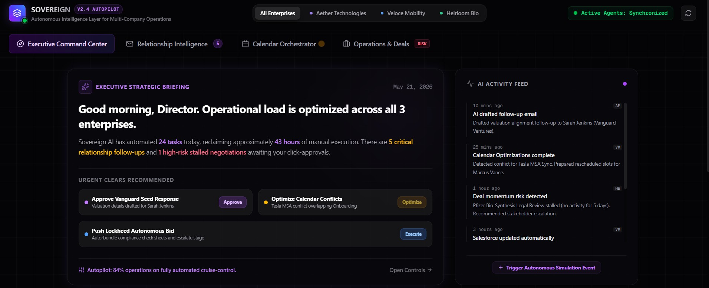

Updated: 2026-07-18

# SOVEREIGN — AI Chief of Staff Platform

> **Autonomous Operational Intelligence Layer for High-Output Founders & Operators.**



SOVEREIGN is a premium, futuristic executive command center designed for operators managing multiple companies simultaneously. It acts as a proactive digital chief of staff that autonomously handles coordination, relationship monitoring, follow-up sequencing, and pipeline execution.

---

## ⚡ Key Highlights & Core Solved Pain Points

### 1. 📬 Follow-Ups Falling Through the Cracks
You're managing relationships across three companies and moving fast. Critical follow-ups with clients, partners, employees, and vendors get delayed or forgotten because you're context-switching between businesses. 

* **The Sovereign Solution:** The Chief of Staff owns this loop entirely—monitoring conversations, calculating the perfect engagement interval, generating automated email/message drafts in your personal voice, and surfacing critical replies for approval.

### 2. 📅 Calendar and Task Coordination Overhead
You're manually blocking time, setting reminders, and coordinating when things get done and what gets sent next. That's administrative work that eats into focus time.

* **The Sovereign Solution:** The CoS handles the sequencing autonomously—scheduling meetings dynamically, resolving overlapping calendar conflicts in real-time, blocking focus hours, and queuing follow-up sequences.

### 3. 💼 Deal and Vendor Workflows Stalling
Multi-step processes (procurement, negotiations, onboarding) require constant back-and-forth coordination. CRM systems like Pipedrive remain stale because you're the bottleneck in these workflows.

* **The Sovereign Solution:** The CoS automates the handoffs and keeps deals moving through the pipeline, vetting safety compliances and dispatching legal drafts without requiring your manual intervention at every stage.

---

## 🛠️ Advanced Tech Stack

* **Framework:** Next.js (with App Router & Turbopack build optimization)
* **Language:** TypeScript
* **Animations:** Framer Motion for premium, high-fidelity card sorting and state transition curves
* **Styling:** Tailwind CSS (v4) with obsidian dark theme grid filters & frosted glassmorphic panels
* **Icons:** Lucide Icons (optimized list)

---

## 🚀 Getting Started Locally

To launch the platform locally:

### 1. Install Dependencies
```bash
npm install
```

### 2. Start the Development Server
```bash
npm run dev
```

### 3. Build for Production
```bash
npm run build
```

Open [http://localhost:3000](http://localhost:3000) in your browser to experience the Sovereign executive autopilot interface.